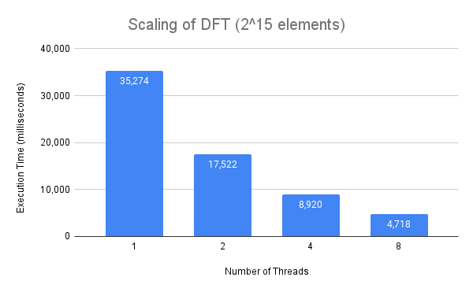

Anuvind Bhat (`anuvindb`) & Saatvik Suryajit Korisepati (`skorisep`)

## **Schedule**

First half of 11/28:     Finish milestone report (Saatvik and Anuvind)
Second half of 11/28:    Finish 2D FFT (comparing 2 ways of parallelizing and transpose optimization) (Saatvik then Anuvind)
First half of 12/05:     Complete image processing (Saatvik then Anuvind)
Second half of 12/05:    Complete write up and convert materials for presentation (Anuvind then Saatvik
Week of 12/12:           Spillover (**not preferred**)

## **Summary**

We have implemented, parallelized, and optimized 3 implementations of 1D DFT/FFT that we had set out to do.

- Quadratic DFT: This started as a straightforward implementation of a matrix-vector product of the DFT (Vandermonde) matrix and the input vector. We computed the elements of the matrix on the fly as they could be determined by the loop indices. This was easily parallelized by parallelizing each dot product. We were able to significantly optimize this by noticing only n elements of the matrix actually needed to be computed (rather than n2) and precomputing them in parallel.

- Recursive FFT: This started as the textbook recursive implementation of the Cooley-Tukey algorithm. We parallelized this using OpenMP tasks, but it didn’t scale very well. Switching to our quadratic DFT implementation at high recursion depths led to better scaling.

- Iterative FFT: This is our most sophisticated and most performant implementation. It started as an in-place, bottom-up computation of FFT using butterfly networks. Parallelism was available at every “level” of the computation (similar to the recursive implementation). We implemented an optimization for precomputing certain roots of unity which required some work to effectively parallelize and an optimization for “chunks” of data that fit in the L1 cache which improved temporal locality.

We will provide more details of our specific optimizations and their motivations in our final report.

## **Progress Regarding Goals and Deliverables**

So far we have been able to meet all of our required goals and have been on track with our specified schedule. Therefore, we believe we will be able to produce all of our required deliverables. Regarding our “nice to haves”, we believe we should be able to complete the image compression application; however, we may not implement the “tiling” optimization for 2D FFT. We noticed that this optimization is very similar to the “chunking” optimization we implemented for 1D FFT, but requires more implementation work. Moreover, the optimization helps when multiple rows/columns fit in the cache; since our focus is on large datasets, we don’t think this will give us an improvement over our 1D FFT optimizations.

## **Presentation Materials**
We will be presenting detailed speedup graphs (and other supporting evidence such as cache access information) for each of our implementations. We also hope to have a simple CLI program that can be used to perform image compression using our most performant implementation.

## **Preliminary Results**

The first chart shows our initial DFT implementation that was parallelized and then optimized (reduced number matrix elements to be computed from n2 to n). However, despite these efforts, we can observe that the quadratic time implementation was significantly worse than any of the FFT implementations.

The second chart below showcases three of our FFT implementations (note the quadratic DFT implementation is not included due to the worse asymptotic behavior). Our initial recursive implementation of FFT had terrible scaling and performance. As can be seen, we were able to significantly improve performance and scaling with different approaches and optimizations. In our final report, we will elaborate further on the drivers of these results and the reasoning for our optimizations.

The third chart showcases the data we utilized to determine the parallel threshold (below which we switched to using DFT) for our parallel recursive implementation of FFT.

