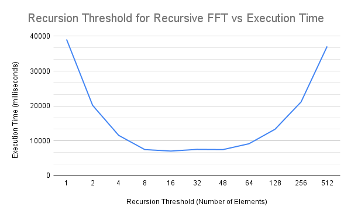

Anuvind Bhat (`anuvindb`) & Saatvik Suryajit Korisepati (`skorisep`)

- [Project Proposal](#project-proposal)
  - [**Summary**](#summary)
  - [**Background**](#background)
    - [*What is FFT?*](#what-is-fft)
    - [*Parallelizing FFT*](#parallelizing-fft)
  - [**The Challenge**](#the-challenge)
  - [**Resources**](#resources)
  - [**Goals and Deliverables**](#goals-and-deliverables)
    - [*Plan to achieve*](#plan-to-achieve)
    - [*Hope to achieve*](#hope-to-achieve)
    - [*Deliverables*](#deliverables)
  - [**Platform Choice**](#platform-choice)
  - [**Schedule**](#schedule)
- [Milestone Report](#milestone-report)
  - [**Schedule - Milestone**](#schedule---milestone)
  - [**Summary - Milestone**](#summary---milestone)
  - [**Progress Regarding Goals and Deliverables**](#progress-regarding-goals-and-deliverables)
  - [**Presentation Materials**](#presentation-materials)
  - [**Preliminary Results**](#preliminary-results)

---

# Project Proposal

## **Summary**

We are going to be parallelizing the one and two-dimensional versions of the Fast Fourier Transform (FFT) algorithm with a focus on alleviating its bandwidth bottleneck. We will be focusing on parallelizing on a shared memory machine while utilizing OpenMP. This project is based on the findings from research conducted by Spiral Lab at CMU as well as additional research that we studied. Upon completing our implementation, we will be analyzing and comparing the performance improvement in terms of speedup, data movement, and data access of our FFT variants.

## **Background**

### *What is FFT?*

FFT (fast Fourier transform) is an algorithm, with roots in signal processing, for computing the so-called discrete Fourier transform (DFT) of a sequence of numbers. The naive approach to computing the DFT takes O(n2) time while FFT computes the result in O(n log (n)) time. In the context of signal processing, FFT is used to decompose a signal into sinusoidal curves with different amplitudes and frequencies. This is known as converting a signal from the time domain to the frequency domain.

### *Parallelizing FFT*

1D FFT is naturally recursive and also has very poor data locality making it a memory bound algorithm. We will be working to alleviate this problem by exploring butterfly networks and iterative implementations that have better cache locality. Available parallelism is similar in both the recursive and iterative approaches. For the recursive implementation, we will also explore using the quadratic DFT algorithm at high recursion depths as it has better locality.

2D FFT performs FFT of rows and then FFT of columns on a two-dimensional input. In this case, the actual computation across the rows and columns can be parallelized. However, the computation of FFT along columns involves strided memory accesses. To alleviate this issue we will be exploring techniques obtained from Spiral Lab’s research (transpose, tiling, etc.) as well as using our optimized version of 1D FFT.

## **The Challenge**

FFT is a memory-bound algorithm that doesn’t scale well with increasing compute. The algorithm has poor access patterns (locality) and does not utilize the cache hierarchy well. Furthermore, due to the recursive nature of the FFT formulation, the available parallelism isn’t the best. We also expect to encounter several other challenges once we begin our implementation.

As we are starting from scratch with our implementation, we expect the sequential implementations also to require significant work.

## **Resources**

We will be using the CPUs of the GHC machines as well as the shared memory nodes on Bridges-2 at the Pittsburgh Supercomputing Center to measure how our implementation scales. We will start from scratch in our implementation. Upon completion of a sequential implementation, we will identify areas for parallelism (possibly in addition to ones we’ll already described) and will work on parallelizing the algorithm.

We will refer to existing research on parallel FFT implementations. For example, we will take a look at Spiral Lab’s work on optimizing FFT memory access through transposes and blocked layouts. Some specific papers/resources we’re relying on are:

1. Slides from Michael Bader’s course on Algorithms of Scientific Computing (FFT specific parts)
2. Large Bandwidth-Efficient FFTs on Multicore and Multi-Socket Systems by the Spiral team
3. FFTs with Near-Optimal Memory Access Through Block Data Layouts by the Spiral team
4. A Fast Fourier Transform Compiler by Matteo Frigo

## **Goals and Deliverables**

### *Plan to achieve*

Parallelize a recursive implementation of 1D FFT with OpenMP. Quantitatively identify bottlenecks and overhead in our parallel implementation and describe them with concepts learned in class. Explore switching to quadratic DFT at high recursion depths. Create another 1D implementation using the concept of butterfly networks and other optimizations (different code-path when data fits in cache) that are easier to perform on an iterative implementation to alleviate the memory bottleneck; parallelize this implementation. Compare the performance of the recursive and iterative approaches and explain any differences. Then we will implement 2D FFT using our 2 variants of 1D FFT. We will further optimize the memory access patterns (spatial locality) of 2D FFT using by transposing key intermediate results based on Spiral Lab’s research.

### *Hope to achieve*

We hope to utilize our new algorithm in the practical setting of image compression. If this step is completed, we will also analyze the performance and compare the results from naive and other image compression algorithms using FFT.

We will also attempt to optimize the 2D FFT implementation further by utilizing the “tiling” approach mentioned in Spiral Lab’s research.

### *Deliverables*

We will predominantly be focusing on showing speedup graphs of our various implementations as well as other performance metrics that we measure. We will also be providing a detailed explanation of why our modifications provide improvements in speedup and locality (memory access). If time allows, we will either have a demo of the various stages in image compression or some images that illustrate them.

## **Platform Choice**

We are going to be implementing the algorithm with a focus on parallelizing on CPUs. We made this decision as the research we explored focused on FFT computation on CPUs. Furthermore, as one of our stretch goals is to apply our algorithm to image compression, we find that a computer’s memory and shared memory machines are more than sufficient for the task.

Since OpenMP can be used for parallelizing all the variants we want to implement (using tasks for the recursive variant), we decided on OpenMP as our framework.

## **Schedule**

Note that we are targeting the early submission deadline of 12/9. 
Week 1 (11/14): Complete proposal with concrete approaches for parallelism and improving memory bandwidth usage and begin sequential implementation  
Week 2 (11/21): Parallelize recursive implementation (1D FFT), start cache-optimized iterative implementation and begin measuring results and bottlenecks (possibly try optimizations involving “chunking” in 1D FFT) 
Week 3 (11/28): Compare performance/scaling of 2D FFT with the 2 different 1D FFT implementations as primitives. Improve cache locality when applying 1D FFT along columns. 
Week 4 (12/5): Further measurements of results, exploring optimizations involving “chunking” of input data in 2D FFT. Final writeup 
Week 5 (12/12): Spillover in case we don’t meet the early deadline target

---

# Milestone Report

## **Schedule - Milestone**

First half of 11/28:     Finish milestone report (Saatvik and Anuvind) 
Second half of 11/28:    Finish 2D FFT (comparing 2 ways of parallelizing and transpose optimization) (Anuvind then Saatvik) 
First half of 12/05:     Complete image processing (Saatvik then Anuvind) 
Second half of 12/05:    Complete write up and convert materials for presentation (Anuvind then Saatvik) 
Week of 12/12:           Spillover 

## **Summary - Milestone**

We have implemented, parallelized, and optimized 3 implementations of 1D DFT/FFT that we had set out to do.

- Quadratic DFT: This started as a straightforward implementation of a matrix-vector product of the DFT (Vandermonde) matrix and the input vector. We computed the elements of the matrix on the fly as they could be determined by the loop indices. This was easily parallelized by parallelizing each dot product. We were able to significantly optimize this by noticing only n elements of the matrix actually needed to be computed (rather than n2) and precomputing them in parallel.

- Recursive FFT: This started as the textbook recursive implementation of the Cooley-Tukey algorithm. We parallelized this using OpenMP tasks, but it didn’t scale very well. Switching to our quadratic DFT implementation at high recursion depths led to better scaling.

- Iterative FFT: This is our most sophisticated and most performant implementation. It started as an in-place, bottom-up computation of FFT using butterfly networks. Parallelism was available at every “level” of the computation (similar to the recursive implementation). We implemented an optimization for precomputing certain roots of unity which required some work to effectively parallelize and an optimization for “chunks” of data that fit in the L1 cache which improved temporal locality.

We will provide more details of our specific optimizations and their motivations in our final report.

## **Progress Regarding Goals and Deliverables**

So far we have been able to meet all of our required goals and have been on track with our specified schedule. Therefore, we believe we will be able to produce all of our required deliverables. Regarding our “nice to haves”, we believe we should be able to complete the image compression application; however, we may not implement the “tiling” optimization for 2D FFT. We noticed that this optimization is very similar to the “chunking” optimization we implemented for 1D FFT, but requires more implementation work. Moreover, the optimization helps when multiple rows/columns fit in the cache; since our focus is on large datasets, we don’t think this will give us an improvement over our 1D FFT optimizations.

## **Presentation Materials**

We will be presenting detailed speedup graphs (and other supporting evidence such as cache access information) for each of our implementations. We also hope to have a simple CLI program that can be used to perform image compression using our most performant implementation.

## **Preliminary Results**

The first chart shows how our optimized DFT implementation achieves nearly perfect scaling. This was one of the motivations for switching over to this implementation at high recursion depths in our recursive FFT implementation. However, the quadratic time complexity of this algorithm makes it unsuitable for use on large datasets.

The second chart below showcases the performance of three of our FFT implementations on a large dataset. Our initial recursive implementation of FFT had terrible scaling and performance. As can be seen, we were able to significantly improve performance and scaling in our other implementations. In our final report, we will elaborate further on the drivers of these results and the reasoning behind our optimizations.

The third chart showcases the data we utilized to determine the threshold (below which we switched to using DFT) for our parallel recursive implementation of FFT.

